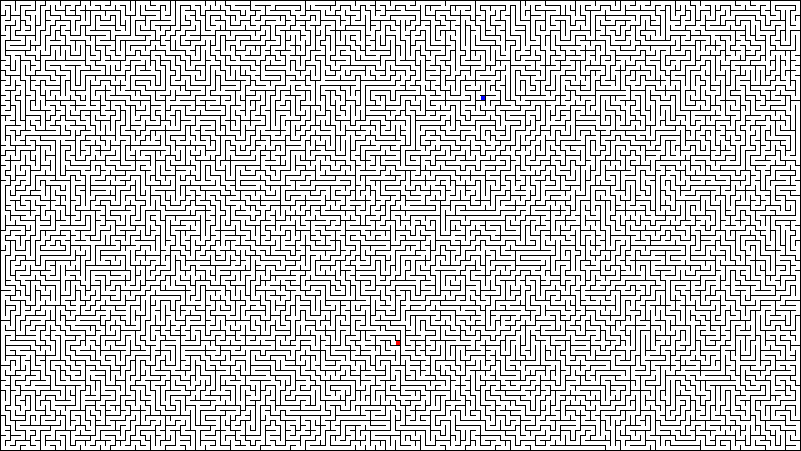
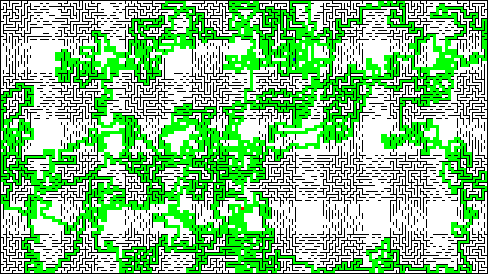

# MazeImageServer

CTF，PPC問題風のサーバ．

迷路を作成し，Base64でエンコードしてプレイヤーに送りつけます．プレイヤーは端点A（#FF0000）と端点B（#0000FF）を結ぶ経路を経路を緑色（#00FF00）で塗った画像を作成し，Base64でエンコードして送り返さなければなりません．

正解の画像を送り返すと次の問題が送られてきます．  
全10問

## Sample

